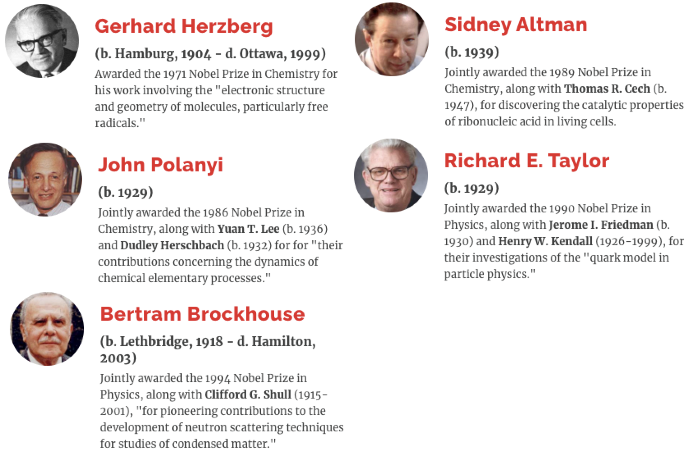

# Canadian Citizenship Study Guide

"Canada" 🇨🇦 means "kanata" in Iroquoian language which means "village".

| [National anthem](https://open.spotify.com/track/4X6BMrIdis11Qe8QhAulTl?si=7ba8e8884f284a91)                           | [Royal anthem](https://open.spotify.com/track/0iIJAyiAZHoIxKYMhsfmCA?si=5c1996dfedec410b)                 |
|-------------------------------------------|------------------------------|
| O Canada!                                 | God save our gracious Queen! |
| Our home and native land!                 | Long live our noble Queen!   |
| True patriot love in all of us command.   | God save the Queen!          |
| With glowing hearts we see thee rise,     | Send her victorious,         |
| The True North strong and free!           | Happy and glorious,          |
| From far and wide,                        | Long to reign over us:       |
| O Canada, we stand on guard for thee.     | God save the Queen!          |
| God keep our land glorious and free!      |                              |
| 𝄆 O Canada, we stand on guard for thee. 𝄇 |                              |

# Historical timeline

## Early history

990 to 1050: the Vikings colonize Newfoundland and Labrador and create the [L'Anse aux Meadows settlement](https://en.wikipedia.org/wiki/L%27Anse_aux_Meadows).

1215: King John of 🏴󠁧󠁢󠁥󠁮󠁧󠁿 signs 📝[**Magna Carta**](https://www.bl.uk/magna-carta/videos/what-is-magna-carta), also known as **Great Charter of Freedoms**. Freedom of conscience and religion; freedom on thought, belief, opinion and expression; freedom of peaceful assembly; freedom of association.

## The first europeans

1497 to 1498: 🧍John Cabot (Italian immigrant in England) is the 1st European to map the East Coast. Claims Newfoundland for 🏴󠁧󠁢󠁥󠁮󠁧󠁿.

1500s: Canada starts appearing on maps.

1535 to 1536: 🧍Jacques Cartier (French) is the 1st European to map the Gulf and River of St Lawrence. Makes three voyages and claims the land for King Francis I of 🇫🇷.

1576: Martin Frobisher (English) goes to the uncharted Arctic for Queen Elizabeth I.

## Royal New France

1600s: settlers from 🇫🇷 start establishing communities in the St Lawrence river.

1604: 🧍Samuel de Champlain is the 1st European to establish a settlement in the Acadia region (St Croix Island and Port Royal).

1608: Samuel de Champlain founds Quebec ("where the river narrows") as a fur-trading post. The French were allied of the Huron but enemies to the Iroquois and English.

1610: 🧍Henry Hudson discovers the Hudson Bay and founds Newfoundland. Settlers from 🏴󠁧󠁢󠁥󠁮󠁧󠁿 start establishing communities.

1665 to 1682: New France is governed by 🧍Jean Talon, the intendant, 🧍Bishop Laval, the Bishop, and 🧍Count Frontenac, the governor.

## Struggle for a continent

1670: King Charles II grants the Hudson Bay Company exclusive rights to trade in Rupert's Land (4 million km2). It ended up dominating trade from Winnipeg to Vancouver.

1690: Count Frontenac refuses to surrender Quebec to the English.

1701: the French and Iroquois sign a [Peace treaty](https://en.wikipedia.org/wiki/Great_Peace_of_Montreal).

1756 to 1763: Seven Years War (globally) between 🇫🇷 and 🇬🇧. In North America they fight for control of New France. The British, as part of their military campaign against New France, force 14k Acadians to leave the Maritime Provinces (["the Great Upheaval"](https://en.wikipedia.org/wiki/Expulsion_of_the_Acadians)) to the 13 American colonies or back to Europe.

1758: First assembly in Nova Scotia.

1759: 🩸 Battle of Plains of Abraham, in Quebec. The 🇬🇧, led by James Wolfe, won against the 🇫🇷, led by Marquis de Montcalm.

1763: [Treaty of Paris](https://en.wikipedia.org/wiki/Treaty_of_Paris_(1763)). 🇫🇷 formally ceded New France to the 🇬🇧, and largely withdrew from the continent.

## The province of Quebec and 1st war with America

1763: 📝**Royal Proclamation** signed by King George III. (a) All land would be considered Aboriginal land, forbid settlers from claiming land from the Aboriginal occupants, unless it has been first bought by the Crown and then sold to the settlers. (b) Introduced policies meant to assimilate the French population to British Rule. (c) 🇬🇧 renames the colony the "Province of Quebec".

1773: First Assembly in P.E.I. 

1774: Signing of 📝**Quebec Act** to abolish the intention to absorb the French population into British Rule. (a) It maintains British criminal law but gives the French rights to practice Catholicism and to run for office. (b) It allows applying French civil law in private matters. (c) It expanded the province's territory into parts of the Indian Reserve. This Act angered the Americans.

1775: 🩸 Americans invade Quebec in an attempt to seize the Province of Quebec. [Lord Dorchester (Guy Carleton)](https://en.wikipedia.org/wiki/Guy_Carleton,_1st_Baron_Dorchester) defeats them.

1776: America declares independence from the British empire. 40k Loyals to the British flee to Quebec and Nova Scotia, including 3k black Loyals.

## Beginnings of democracy and abolition of slavery

1785: First Assembly in New Brunswick.

1791: Signing of the 📝**Constitutional Act**. The "Province of Quebec" is divided through the Ottawa river into [Lower Canada to the east (with Canadiens) and Upper Canada to the west (for the Loyals)](https://d3d0lqu00lnqvz.cloudfront.net/media/media/d1817dce-5cf3-4afa-85b7-a8d39574989e.jpg). Grants legislative assemblies to both (the colonies already had it). Settlers elected the assemblies, which could make laws and raise taxes, but they weren't passed until the governor and councils approved.

1793: 1st elected assembly of Lower Canada. Also, slavery is abolished in Upper Canada by 🧍[John Simcoe](https://en.wikipedia.org/wiki/John_Graves_Simcoe).

1807: British parliament prohibits buying and selling slaves.

## 2nd War with America

1812: 🩸 USA invades Canada and loses. Causes of the war included British attempts to restrict U.S. trade, the Royal Navy's impressment of American seamen and America's desire to expand its territory. Canadian volunteers, British troops and First Nations defended against the invasion. The Americans burned down the government house and parliament house, the Cnadians burned down the White House in Washington DC. 🧍 War heroes: [Isaac Brock](https://en.wikipedia.org/wiki/Isaac_Brock) (Upper Canada), [Charles de Salaberry](https://en.wikipedia.org/wiki/Charles_de_Salaberry) (Montreal), [Robert Ross](https://en.wikipedia.org/wiki/Robert_Ross_(British_Army_officer)) (Washington, DC), [Laura Secord](https://en.wikipedia.org/wiki/Laura_Secord) (Niagara).

1832: Montreal stock exchange opens. First Assembly in Newfoundland.

1833: the British abolish slavery in the Empire.

1837 to 1838: rebellions start in Lower and Upper Canada to reclaim more democracy, adopt American values and maybe join the United States. They were defeated.

## Responsible government

1839: 🧍[Lord Durham](https://en.wikipedia.org/wiki/John_Lambton,_1st_Earl_of_Durham) is sent from 🇬🇧 to unite Lower and Upper Canada and to grant "responsible government" (the ministers of the Crown must have the support of the majority of the elected representatives in order to govern, and if they lose the support, they must resign).

1840: Upper and Lower Canada unite as "Province of Canada".

1847: Nova Scotia gains responsible government.

1849: 🧍[La Fontaine](https://en.wikipedia.org/wiki/Jean_de_La_Fontaine), champion of democracy and French language rights, becomes the 1st head of responsible government for the Province of Canada.

1850 to 1860: American slaves flee to Canada through the "Underground Railroad".

1853: 🧍[Mary Ann Shadd Cary](https://en.wikipedia.org/wiki/Mary_Ann_Shadd) becomes the first woman publisher, helping found _The Provincial Freeman_ dedicated to anti slavery and black immigration.

1865: USA abolishes slavery through the 13th amendment.

## Confederation

1864 to 1867: [Thirty-six representatives](https://thecanadianencyclopedia.ca/en/article/fathers-of-confederation-table) of Nova Scotia, New Brunswick and Province of Canada ("fathers of Confederation") meet in 3 conferences (Charlottetown, Quebec, London) to establish a new country. 🧍Étienne-Paschal Taché and George-Étienne Cartier (Quebec), Samuel Leonard Tilley (New Brunswick), John A. Macdonald (Ontario)

1867: signing of 📝**British North American Act** (also called **Constitution Act**), Canada's original Constitution document. [Confederation](https://www.thecanadianencyclopedia.ca/en/article/confederation): the Province of Canada is split into Quebec and Ontario, and NB and NS join them to make the "Dominion of Canada". Peace, Order and Good Government. Government split into federal and provincial. 🧍[John A. Macdonald](https://en.wikipedia.org/wiki/John_A._Macdonald) becomes the 1st Prime Minister.

1869: The Hudson’s Bay Company sells Rupert’s Land to Canada. The Metis living there are not consulted.

1870: 🧍Louis Riel (Metis, father of Manitoba) leads an uprising in Fort Garry (Manitoba) and is defeated, but his demands are met. _Manitoba and the Northwest Territories join the Confederation._

1871: _British Columbia joins the Confederation after Ottawa promises to build a railway to the west coast._

1873: _P.E.I. joins the Confederation, also wanting a railway._ The Northwest Mounted Police, precursor to the Royal Canadian Mounted Police, is founded in Regina and with forts in Calgary, MacLeod and other cities.

1880: _The Arctic Islands are transferred to the Northwest Territories._

1875 to 1885: construction of the Canadian Pacific Railway (CPR) which unites the country. Starts in Fort Williams (Ontario), ends in Craigellachie (BC). Recruited 15k Chinese workers. 

1883: 🧍[Emily Stowe](https://en.wikipedia.org/wiki/Emily_Stowe), the first female physician to practise in Canada, founds the Canadian Women's Suffrage Association.

1885: Second Metis uprising in Saskatchewan, also defeated. Introduction of [Chinese Head Tax](https://en.wikipedia.org/wiki/Chinese_head_tax_in_Canada) (originally 50 CAD, later 500 CAD) to stop Chinese immigration.

1898: _Yukon joins the Confederation._

1900: the [White Pass and Yukon Route railroad](https://en.wikipedia.org/wiki/White_Pass_and_Yukon_Route) (172 km) opens from Skagway (Alaska, USA) to Whitehorse (Yukon).

1905: _Alberta and Saskatchewan join the Confederation._

1890s to early 1900s: economic boom fueled by industrialization. [All-time high numbers of immigrants](https://www150.statcan.gc.ca/n1/pub/11-630-x/11-630-x2016006-eng.htm), who use the CPR to move to the West and thrive in agriculture.

1899 to 1902: Canada sends 7k volunteers to the Boer War in South Africa.

## First World War

1914 to 1918: 🩸 World War One. Canada sends 600k soldiers, 60k of whom died. In 1917 Canadians fight the Battle of Vimy Ridge in 🇫🇷. 🧍 [Sir Arthur Currie](https://www.thecanadianencyclopedia.ca/en/article/sir-arthur-currie), the first Commander of the Canadian Corps, is named Canada's Greatest soldier, after leading the Canadian Corps to several important victories. Ottawa interns 8k former Austro-Hungarian subjects as "enemy aliens" in 24 labour camps.

1915: John McCrae writes the famous poem ["In Flanders Fields"](https://en.wikipedia.org/wiki/In_Flanders_Fields#Poem) after his best friend dies in the war.

## Women's vote, Roaring Twenties and Depression

1916: Manitoba becomes the 1st province to grant women the right to vote.

1918: Most female citizens aged 21 and over are granted the right to vote in federal elections (first to nurses at the battle front, then to women who were related to men in active wartime service).

1920s: the Roaring Twenties.

1921: 🧍[Agnes Macphail](https://en.wikipedia.org/wiki/Agnes_Macphail) becomes the 1st woman in the House of Commons. King George V assigns red and white as Canada's national colors (they had been colours of France and England since the Middle Ages).

1920 to 1933: The Group of Seven, Canadian landscape painters, including 🧍[Emily Carr](https://en.wikipedia.org/wiki/Emily_Carr).

1930: Great Depression. The stock market collapses and unemployment rises. Low grain prices and drought.

1934: the Bank of Canada is created.

## Second World War

1939 to 1945: 🩸 World War Two. Canada sends 1 million soldiers, 44k of whom died. On June 6, 1944, 15k Canadians participate on [D-day](https://en.wikipedia.org/wiki/Normandy_landings) in Juno Beach. Canada contributed more to the Allied air effort than any other Commonwealth country, with over 130,000 Allied air crew. Unsuccessful defence of Hong Kong from Japan in 1941. The Royal Canadian Navy defended merchant ships from the German submarines in the Battle of the Atlantic. Canada forced relocation of Japanese people in Canada and sold their properties.

## Modern Canada

1940: Quebec grants women the right to vote thanks mostly to 🧍[Therese Casgrain](https://en.wikipedia.org/wiki/Th%C3%A9r%C3%A8se_Casgrain). Employment insurance is introduced.

1946: Canadians can no longer make appeals to British courts. The Supreme Court of Canada becomes Canada's highest judicial body.

1947: Oil is discovered in Alberta.

1949: _Newfoundland becomes the 10th and last province to join Canada._

1950 to 1953: Canada participates in the Korean War, defending South Korea.

1952: Elizabeth II becomes Queen of England.

1960 to 1966: [Quiet revolution](https://www.thecanadianencyclopedia.ca/en/article/quiet-revolution-plain-language-summary) in Quebec.

1960: Introduction of the "social safety net": universal medical care, pension. Aboriginals gain the right to vote.

1965: the Canadian flag is raised for the 1st time in Ottawa.  

1967: the Order of Canada is created to recognize outstanding citizens.

1969: signing of 📝**Official Languages Act**. English (spoken by 58%) and French (spoken by 21%, mostly in Quebec) become official languages at a _federal_ level.

1980: "O Canada" becomes the national anthem.

1982: Queen Elizabeth II signs the 📝**Canadian Constitution Act**, without approval from Quebec. It grants full independence for Canada by allowing the country to change its Constitution without approval from 🇬🇧. Signing of the 📝**Canadian Charter of Rights and Freedoms** which gives Mobility Rights (live and work anywhere in the country), Aboriginal Peoples' Rights, Official Language Rights and Minority Language Educational Rights, Multiculturalism.

1988: John Mulroney signs an official apology to the Japanese community for the WW2 internment camps in BC.

1990: Canadian Space Agency (CSA) is established. It launched [Canadarm2](https://www.asc-csa.gc.ca/eng/iss/canadarm2/about.asp) in 2001.

1999: _Nunavut becomes the last territory to join the Confederation._

2006: Quebec is declared a nation within Canada. A formal apology is published to the Chinese community for the discriminatory head tax.

2009: Ottawa formally apologizes to the Aboriginal community for the [residential schools](https://www.youtube.com/watch?v=VFgNI1lfe0A) where aboriginal children were placed to absorb them into mainstream Canadian culture. The schools were poorly funded and inflicted hardship and abuse. 

# Founding peoples

1. Aboriginal / Indigenous: the first inhabitants of Canada who came from Asia thousands of years ago.
   - First Nations (65%). Half live on reserve land, half on cities.
   - Inuit (4%, "the People"). They live in the Arctic and speak Inuktitut.
   - Metis (30%, "mixed"). They live in the Prairies and speak Michif. Their ancestry is mixed aboriginal and European.
2. English: off the Hudson Bay, built trading posts, didn't mix with the locals.
3. French: off the St Lawrence River, create an empire, mixed with the locals.

# Economy

Early Canada's economy: fur, fish, timber.

Today's economy: service industry, manufacturing industry, natural resources (oil, mining, fishing, farming).

Canada is part of NAFTA (USA and Canada since 1988, Mexico since 1994), part of the G8, part of NATO, part of WTO.

Canada has close relations with USA and each is the other’s largest trading partner. Over three-quarters of Canadian exports are destined for the U.S.A. It's the biggest bilateral trading relationship in the world.

# Geography

2nd largest country. 10 million km2. ~34 million people. 10 provinces and 3 territories. [6 timezones (Pacific, Mountain, Central, Eastern, Atlantic, Newfoundland)](https://upload.wikimedia.org/wikipedia/commons/c/c5/Canada_time_zone_map_-_en.svg). 5 regions (Atlantic provinces, Central Canada, Prairies, West Coast, Northern Territories)

Capital: Ottawa, chosen in 1857 by Queen Victoria. Has the House of Commons and the Senate.

Atlantic provinces: 
- Cool winters and cool humid summers
- **Newfoundland and Labrador**: oldest colony of the British Empire. Fisheries, off-shore oil and gas extraction, hydro-electric resources.
- **P.E.I**: beaches, red soil, potatoes. Birthplace of the Confederation. Connected to Canada through the [Confederation bridge](https://en.wikipedia.org/wiki/Confederation_Bridge). Location of the book Anne of Green Gables by Lucy Montgomery.
- **Nova Scotia**: world's highest tides in the Bay of Fundy. Shipbuilding, fisheries, off-shore oil and gas extraction, shipping. Largest naval base in Halifax. [Military tattoo festival in Halifax](https://www.youtube.com/watch?v=cwTAq29u8Rk).
- **New Brunswick**: founded by Loyalists and home to the St John River system. Forestry, agriculture, fisheries, mining, food processing, tourism. Important cities: Saint John (largest city and port), Moncton (principal Anglophone Acadian centre), Fredericton (capital). The only fully bilingual province.

Central Canada:
- Cold winters and warm humid summers
- More than half of the country's population lives here
- Heart of manufacturing and industry
- **Quebec**: 3/4 speak French as main language, highest number of bilinguals. Forestry, energy and mining. Main producer of pulp and paper and hydroelectricity. Leaders in pharmaceuticals and aeronautics.
- **Ontario**: one third of all Canadians. Service and manufacturing industry. Niagara region is known for vineyards, wines and fruit crops. Dairy, beef cattle, poultry, vegetable and grain crops. [Great Lakes](https://en.wikipedia.org/wiki/Great_Lakes) HOMES (Huron, Ontario, Michigan, Eerie, Superior), freshwater interconnected lakes that enable travel, fishing and shipping.

Prairie provinces:
- Dry, cold winters and hot summers
- Rich in energy resources and some of the most fertile farmland in the world
- **Manitoba**: agriculture, mining and hydroelectricity. Winnipeg, the capital, has the Portage & Main intersection, famous for being close to the longitudinal centre of Canada. The city has a big Francophone community, Ukrainians, and Aboriginals.
- **Saskatchewan**: the "breadbasket of the world"/"wheat province". Largest producer of grains and oilseeds. Has deposits of uranium and potash, and produces oil and natural gas. Regina has the RCMP training academy. Saskatoon is the largest city and is home of the mining industry.
- **Alberta**: named after the fourth daughter of Queen Victoria, Princess Louise Caroline Alberta. Has 5 national parks, including Banff (1855). Has the Badlands, home to prehistoric fossils. Largest producer of oil and gas and beef.

West Coast: 
- Temperate climate
- **British Columbia**: Vancouver has the largest and busiest port. Forestry, mining, fishing, fruit orchards, wineries in the Okanagan Valley. 600 provincial parks. Has a big population of Chinese and Indian. The capital, Victoria, has the navy's Pacific fleet.

Northern Territories:
- Cold winters (record of -63C) and short cool summers
- One third of the country's territory, but they only contain a population of 100k
- Gold, lead, copper, diamond, zinc mines. Hunting, fishing, and trapping.
- "Land of the Midnight Sun" because in summer the day lasts 24 hours.
- **Yukon**: miners came here during the Gold Rush in the 1890s. The White Pass and Yukon Railway is a tourist attraction. Has the highest mountain in Canada, Mount Logan, at 6km, named after the geologist [William Logan](https://en.wikipedia.org/wiki/William_Edmond_Logan).
- **Northwest Territories**: originally made up in 1870 from Rupert's Land and the North-Western Territory. The capital, Yellowknife, is called the "diamond capital of North America". Home to the Mackenzie River which is 4200 km long.
- **Nunavut**: means "our land" in Inuktitut. Established in 1999, the capital used to be called Frobisher Bay. The population is 85% Inuit.

# Canadian symbols

- Canadian crown is a symbol of the government
- Fleur-de-lys, featured in the flag of Quebec
- Maple leaf 🍁 since 1700s and in flags since 1965
- [Coat of arms](https://upload.wikimedia.org/wikipedia/commons/thumb/9/96/Royal_arms_of_Canada_%28lesser_version%29.svg/1280px-Royal_arms_of_Canada_%28lesser_version%29.svg.png) since WW1, resembles the UK coat of arms
- Motto: "from sea to sea", since 1871
- Beaver 🦫
- Royal Canadian Mounted Police (RCMP), except in Ontario and Quebec
- [Terry Fox](https://en.wikipedia.org/wiki/Terry_Fox) 🏃‍♂️. In 1980 runs one-legged "marathon of hope" to raise money for cancer research. He ran from St John, Newfoundland to Thunder Bay, Ontario.
- [Rick Hansen](https://en.wikipedia.org/wiki/Rick_Hansen). From 1985 to 1987 he trekked 40k kilometers on a wheelchair (8 hours or 75 km per day on average).
- Snowbirds ✈️ that do air demonstrations

# Sports

- Ice hockey, in winter, most popular spectator sport. The Stanley Cup for men, Clarkson Cup for women. Wayne Gretzky (Edmonton Oilers) is the greatest player.
- Soccer, the sport with most people registered
- Canadian football
- Curling
- Lacrosse, in summer

Basketball was invented by Dr. James Naismith in 1891.

# People

Religions: mostly Catholic. Some Protestants. A few Muslims, Jews, Hindus and Sikh.

Gay people are allowed to marry and men and women are equal under the law.

Immigration comes from England, France, Scotland, Ireland, Germany and Asia.

Famous Canadians:

- Alexander Graham Bell: telephone📞
- Sir Sandford Fleming: timezones🕠
- Joseph-Armand Bombardier: snowmobile☃️
- Matthew Evans, Henry Woodward: light bulb💡
- Reginald Fessenden: radio📻
- Dr. Wilder Penfield: brain surgeon🧠
- Dr. John Popps: cardiac pacemaker❤️
- Frederic Banting and Charles Best: insulin💉
- John Buchan🤵‍♂️: 1st Baron Tweedsmuir, popular Governor General of Canada, was enthusiastic about development of Canadian culture and identity.
- Marjorie Turner-Bailey🏃‍♀️: Olympian sprinter descended from black Loyalists.
- Pierre Le Moyne d'Iberville🪖: great hero of New France, winning many victories over the English.
- Sir Sam Steele🪖: a great frontier hero during the Gold Rush, Mounted Policeman and soldier
- Phil Edwards🏃‍♂️: Olympian runner, physician, captain of the Canadian army and expert in tropical diseases
- Donovan Bailey🏃‍♂️: Olympian sprinter, first Canadian to legally break the 10-second barrier in the 100m
- Mike Lazaridis and Jim Balsillie🤵‍♂️: owners of RIM, the makers of Blackberry.

Nobel prize winners:

| Color | Money amount | Person | Known for |
| - | - | - | - |
| 🟦 | $5 | Wilfrid Laurier | 1st French Canadian PM | 
| 🟪 | $10 | John A. Macdonald | 1st PM | 
| 🟩 | $20 | Queen Elizabeth II | ... |
| 🟥 | $50 | William Lyon Mackenzie King | 10th PM (Great Depression and WW2) | 
| 🟨 | $100 | Robert Borden | 8th PM (WW1) | 

| Date | Holiday |
| - | - |
| January 11 | Sir John Macdonald Day |
| April 9 | Vimy Day |
| May 25 | Victoria Day (birthday of Queen Victoria) |
| June 24 | Feast of St. John the Baptist (Quebec) |
| July 1 | Canada Day |
| First Monday of September | Labour Day |
| Second Monday of October | Thanksgiving |
| November 11 | Remembrance Day, for veterans and fallen soldiers. Wear a red poppy! |
| November 20 | Sir Wilfrid Laurier Day |
| December 26 | Boxing day |

Quebec had two referendums to become independent, in 1980 and 1995. In both, people voted to stay in Canada.

Responsibilities of Citizens: obey the law, help the community (volunteer), participate in jury when called to do so, protect the environment, defend Canada (non-compulsory military service), take care of oneself and family, work had and improve skills.

The 🎖️ Victoria Cross (V.C.) is the highest honour available to Canadians and is awarded for the most conspicuous bravery, a daring or pre-eminent act of valour or self-sacrifice, or extreme devotion to duty in the presence of the enemy. The V.C. has been awarded to 96 Canadians since 1854.

# Government

Democracy begins with the first elected government assemblies: Nova Scotia in 1758, P.E.I. in 1773, New Brunswick in 1785.

Canada is a:

1. Federal state, with 3 levels of governments.
2. Constitutional monarchy: the Queen is head of state but only has symbolic powers. The PM is the head of the government.
3. Parliamentary democracy: leaders are elected and they obey the people.

3 levels of government:

1. Federal: makes laws for national defense, foreign policy, finance, interprovincial trade and communication, currency, navigation, criminal law and citizenship.
2. Provincial: makes laws for education, healthcare, natural resources, highways, policing, etc. Made up of 87 MLAs (in BC).
3. Municipal: makes by-laws for garbage collection, firefighters, snowplowing, libraries, sewers, construction, etc. Made up of the mayor and the city council.

The shared responsibilities of the federal and provincial governments are agriculture, immigration, and environment.

The Governor General (currently Mary Simon) is the representation of the Queen. Appointed by the PM, she signs bills and performs symbolic duties. Her term lasts 5 years.

Each province has a Lieutenant General, with a similar role to the Governor General; and a Premier, with a similar role to the PM (it's called Commissioner in the territories).

The PM selects the [Cabinet](https://pm.gc.ca/en/cabinet) (~40 people) from the House of Commons. They run federal departments, prepare the budget and prepare new laws.

3 branches of government:

1. Executive (PM, Cabinet). Execute laws.
2. Legislative (Sovereign, the Senate and the House of Commons). Makes laws.
3. Judicial (Supreme Court). Enforce laws.

Parliament has 3 parts:

1. the Sovereign, who is represented  by the Governor General
2. the Senate, which is made of 105 Senators appointed on the Prime Minister’s recommendation and who are in their role up until their 75th birthday
3. the House of Commons, made up of 308 MPs elected by voters. In the House of Commons, there are Government Members and Opposition Members (those from the party with the 2nd most votes).

How laws are made: bills are proposed by Cabinet -> approved by House of Commons -> approved by the Senate -> approved by Governor General -> law.

1. First reading: the bill is printed and considered read
2. Second reading: members debate the bill's principle
3. Committee stage: committee members study the bill clause by clause
4. Report stage: members can make amendments
5. Third reading: members debate and vote on the bill
6. Senate
7. Royal assent: the bill passes both houses

| Current leader | Party |
| - | - |
| Justin Trudeau | Liberal |
| Candice Bergen | Conservative |
| Yves-François Blanchet | Bloc Québécois |
| Jagmeet Singh | NDP | 

# Justice

Sources of law:
- Parliament
- Provincial legislatures
- English common law
- France's civil code
- Unwritten constitution from UK

_Habeas corpus_, the right to challenge unlawful detention by the state, comes from English common law.

_Presumption of innocence_: everyone is innocent until proven otherwise.

_Due process_: the government must respect all the legal rights a person is entitled to.

The Judiciary branch is made up of the Supreme Court, which consists of 9 judges appointed by the Governor General. They are there until their 75th birthday and can throw out laws that they deem violate freedoms. Below the Supreme Court are the Federal Court and the Provincial Courts. These include appeal courts, trial courts, and other courts (family, traffic, etc).

The Court settles disputes. The police keeps people safe and enforces laws.

# Elections

The country is divided into 308 electoral districts or _ridings_ or _constituencies_.

Canadian citizens over 18 years old and who registered in the National Register of Electors (can be added even on the election day) pick MPs for the House of Commons. They receive an election card saying when and where to vote.

The party that wins the most seats, wins. The leader of that party becomes the Prime Minister.

The party that wins becomes a majority government if they have more than half the seats. If they don't, they become a minority government. They keep running until they lose the confidence of the majority of the MPs. If a majority of the MPs vote against a major government decision, the party in power is defeated and the PM asks the Governor General to call for an election.

Elections happen every 4 years. Vote is secret.